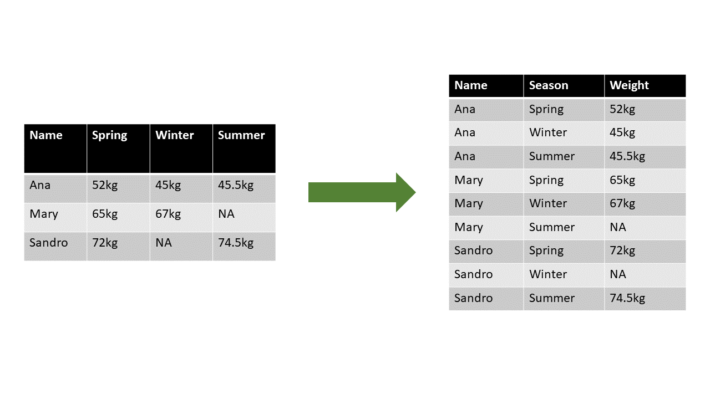

```{r setup, include=FALSE}
knitr::opts_chunk$set(echo = TRUE)
```


## Tidyverse

{width=20%}

https://www.tidyverse.org/


Load **tidyverse**
```{r}
library(tidyverse)
```


## _Tidy Data_

https://tidyr.tidyverse.org/articles/tidy-data.html#data-tidying-1

### From messy to tidy data



## [_Penguin Data_](https://allisonhorst.github.io/palmerpenguins/)

Load **Palmerpenguins**
```{r }
library(palmerpenguins)

data(package = 'palmerpenguins')
```


## Import Data

### [`readr`](https://readr.tidyverse.org/articles/readr.html) 

```
read_csv(file, col_names = TRUE, col_types = NULL, na = c("", "NA"))
```

```{r, message = FALSE}
penguin_data = read_csv("dataset/penguins_data.csv")
```

## First Overview at Data

### [`dplyr`](https://dplyr.tidyverse.org/articles/dplyr.html#filter-rows-with-filter-)  and [`purrr`](https://purrr.tidyverse.org/)

Let's look at the general structure of the data with `dplyr::glimpse()` to figure out what type of variables a.k.a features do we have
```{r}
glimpse(penguin_data)
```

We can also just check dimension of the data by `dim()`
```{r}
dim(penguin_data)
```

| `slice_head` , `slice_tail` and `slice_sample`  from `dplyr`are another way to have an overview of the top, bottom and random rows, respectively. 
| With `n = ...` argument we can specify number of rows to display

```{r}
slice_head (penguin_data, n = 5)
slice_tail(penguin_data, n = 3)
slice_sample(penguin_data, n = 10)
```

| Now we can see that the features **species, island and sex** are categorical variables and should be coerced as factors in our data.
| Additionally, we can see that date has different years but all the measurements are taken in November (11). Thus, we can drop the column **date** and just use  **year** variable if we need different dates. 


One way of doing coercion is to _'re-read'_ file into R and explicitly indicate in `readr::read_csv` the arguments for `col_types`

The functions for converting variable types are: 

* `col_factor()`
* `col_logical()`
* `col_numeric()`
* `col_double()`
* `col_character()`
* `col_date(format = "")`

```{r}
#save the result as another tibble 
penguin_data02 = read_csv("dataset/penguins_data.csv", 
         col_types = cols(species = col_factor(c("Adelie",  "Gentoo",  "Chinstrap")),
              island = col_factor(c("Torgersen","Biscoe", "Dream")),
               sex = col_factor(c("female", "male")),
              # skip the date column while reading the file
              date =  col_skip()))
```

`col_only()` is also a nice option for importing only the selection of columns.

Another way of converting column variable types is the function `map()` from `purrr package`
```{r}
penguin_data[,1:3] = purrr::map(penguin_data[, 1:3], factor )

#check the structure of the data after conversion
glimpse(penguin_data)

```

Finally, the same command can be executed by indexing columns with _names_ rather than _number of the element location_ 
```{r}
penguin_data[, c("species", "island", "sex")] = purrr::map( penguin_data[, c("species", "island", "sex")], factor)

# display data structure
str(penguin_data, give.attr = F)
```

| `summary` gives a nice overview of the whole dataset. 
| It's especially useful for checking factor levels, descriptive stats for numeric values and missing values - NA in each column.
```{r}
 summary(penguin_data02)
```


## Pipe Operator

Pipe operator  `%>%` is  part of  [`magrittr`](https://magrittr.tidyverse.org/) package from `tidyverse` ecosystem.

[A nice tutorial for beginnes](https://www.datacamp.com/community/tutorials/pipe-r-tutorial)

* `function (data)`is the same as `data  %>% function`
* `function_2 ( function_1 (A) )` equivalent of
```
A %>% 
 function_1 %>% 
 function_2
 ```
 * ` B = function_2 ( function_1 (A) )` equivalent of
```
B = A %>% 
 function_1 %>% 
 function_2
 ```


## Reshape into tidy data 

[`tidyr`](https://tidyr.tidyverse.org/)

Now, let's check whether we have a tidy data or not

```{r}
 slice_head(penguin_data02, n = 10)
```

| I appears that each penguins has several rows for each measurement, 4 in total. We can see that by looking at the __id__, for example, as each penguin has an unique id assigned. 
| As per tidy data concept, we know that each measurement must have one row and each variable a separate column. In our case, observation for _each penguin_ should occupy only one row. Since each measurement is done once per penguin, we can have each measurement as a separate column. 

Let's convert/reshape it to a wider format using `pivot_()` functions from `tidyr` package

 ``` 
 pivot_wider (data, 
              names_from = name, 
              values_from = value )
```
```{r}
# save the output  as penguin_df_wide
penguin_df_wide = penguin_data02 %>%
  pivot_wider(names_from = measurements,
              values_from = values) 

#see the first 10 rows  
slice_head(penguin_df_wide, n = 8)

#see the structure of the data
  glimpse(penguin_df_wide)
```

| Just to compare we can turn it back to longer data using `pivot_longer` These functions mirror each other. 
| Note that in case of `pivot_longer` we have to give new columns names using strings of characters with `""` quotation marks.


```
pivot_longer(data, 
             cols,  
             names_to = "name",  
             values_to = "value",   
             values_drop_na = FALSE )
```    


```{r}
penguin_df_wide %>%
  pivot_longer(cols = bill_length_mm : body_mass_g,
                 names_to = "measurements",
                values_to =  "values")
```
Exploring again to compare to the longer version

`dim(), slice_head(), slice_tail(), summary(), names/colnames(), rownames(), str (), glimpse(), levels ()`
```{r}
dim(penguin_df_wide)

slice_tail(penguin_df_wide, n = 3)

str(penguin_df_wide)

# print factor levels of 3 columns
sapply(
  penguin_df_wide[, c("species", "island", "sex")], 
  FUN = levels
  )

# to see character vector of column names
colnames(penguin_df_wide)
```
```{r}
summary(penguin_df_wide)
```

## Data Manipulation and Transformation Tricks
 
### [`dplyr`](https://dplyr.tidyverse.org/)
 
### [`select()`](https://dplyr.tidyverse.org/reference/select.html) Selects columns by their name and returns tibble
 
```{r}
penguin_df_wide %>%
  # select only species and body mass from the whole data
  select(species, body_mass_g) %>%
  slice_sample(n = 5)
```

We can use `:` operator for selecting multiple consecutive columns. In addition, while selecting, it is possible to rearrange the order of columns.
```{r}
penguin_df_wide %>%
  
  select(id, 
         species:year) %>%
  
  slice_sample(n = 5)
```

Exclude selected rows with `-` sign in front of their names
```{r}
penguin_df_wide %>%
   
  select(- (year:id) ) %>%
  
  slice_sample(n = 5)

```


Select has several __"helper" verbs__ which make it possible to select columns based on some pattern in their names

Some of the verbs are

* `starts_with()`
* `ends_with()`
* `contains()`
* `everything()` 
* `where()`

```{r}
penguin_df_wide %>%
  select( starts_with ("bill"), ends_with("g") ) %>%
  slice_sample(n = 5)
```
| The columns we need to access don't have to have only the similar start or end. 
| With `contain()` we can use common patterns within the column names  
```{r}
penguin_df_wide %>%
  select(id,  contains ("leng") ) %>%
  slice_sample (n = 5)
```
renaming while selecting
```{r}
penguin_df_wide %>%
  select(individual_id = id, 
         date = year,  
         location = island ) %>%
  slice_sample (n = 5)
```

In contrast to the above example, we can rename several columns while _keeping_ all the columns using `rename()`
```{r}
penguin_df_wide %>%
  rename(individual_id = id, 
         date = year,  
         location = island ) %>%
  slice_sample (n = 5)
```

Rearranging columns after renaming using `everything()` and drop the missing values from every row using `drop_na`
```{r}
penguin_df_wide %>%
   
  rename(individual_id = id, 
         date = year,  
         location = island ) %>%
  
  select(individual_id, sex,
         everything()) %>%
  
  drop_na() %>%
  
  summary()


```

One cool trick to put column(s) at the end of the data-frame
```{r}
penguin_df_wide %>%
   
  select( - (year:id),
         everything()) %>% #select(everything(), year:id) doesn't work the same way 
  
  slice_sample(n = 5)

```

Now the new function [`relocate()`](https://dplyr.tidyverse.org/reference/relocate.html) does the job of changing location of columns in various ways
```
relocate(.data, ..., .before = NULL, .after = NULL)
```
```{r}
penguin_df_wide %>%
   
  relocate(year:id, .after = last_col()) %>% 
  
  slice_sample(n = 5)

```
```{r}
penguin_df_wide %>%
   
  relocate(id, .before = species) %>% 
  
  slice_sample(n = 5)

```

| Lastly, `select()` can select columns based on certain condition using `where()`  
| It takes a __function__ as an argument, applies it to all columns and selects those for which the function returns `TRUE`
| The arguments can be functions such as `is.character()`, `is.factor()` etc. or even custom made ones.

```{r}
penguin_df_wide %>%
  select (where (is.numeric)) %>% 
  slice_sample(n = 5)
```
 
### Changing column values with [`mutate()`](https://dplyr.tidyverse.org/reference/mutate.html)

`mutate()` can be used to perform calculations from the existing columns and add the result as a new column
```{r}
penguin_df_wide %>%
  
  select(contains("mm")) %>%
  
  mutate(bill_length_cm = bill_length_mm / 10,
         bill_depth_cm =  bill_length_mm / 10,
         flipper_length_cm = flipper_length_mm / 10) 
  
```

If we only need the new variables we can use `transmute()`
```{r}
penguin_df_wide %>%  
  transmute (bill_depth_length_ration =  bill_depth_mm / bill_length_mm ) %>%
  drop_na()
```


| With the updated `dplyr`we have a new function called [across()](https://dplyr.tidyverse.org/articles/colwise.html#basic-usage-1) 
| It takes 2 arguments - names of columns to operate on and a function. we need to specify  a function such as `mean` or `median` or some inline function using `~` and `.x` argument. 

Using `across()`with `mutate`we can apply the same calculation as above to multiple columns simultaneously
 
```{r}
penguin_df_wide %>%
  # select every column that contains "mm"in name
  select(contains("mm")) %>%
  # remove missing values
  drop_na() %>%
  # divide every column by 10 
  mutate(across (everything(),
                ~.x / 10 )
         ) 
  
```

Using `mutate`and [`if_else`](https://dplyr.tidyverse.org/reference/if_else.html) we can calculate or create a categorical new column based on certain condition

`ifelse` takes a condition and options for when the condition's `TRUE` or `FALSE` and accordingly applies them to every element of a vector - _vectorized function_.

```
if_else (condition, true, false, missing = NULL)
```

```{r}
# take median body mass of all penguins
median_mass = median(penguin_df_wide$body_mass_g, na.rm = T)
#print the value
median_mass

penguin_df_wide %>%
  select(sex, body_mass_g) %>%
  # remove missing values
  drop_na() %>%
  #create a new column to categorize penguins based on their mass  
  mutate(size = if_else(body_mass_g  >= median_mass, "large_penguin", "small_penguin")) %>%
  slice_sample(n = 10)

```


### Filtering and changing order of rows by [`filter`](https://dplyr.tidyverse.org/reference/filter.html) and [`arrange`](https://dplyr.tidyverse.org/reference/arrange.html)

| With `filter()` we can filter and pick rows based on certain criteria or condition. 
| `arrange()`then sorts the rows with ascending or descending order, or by the alphabet. 

```{r}
# choose only the rows corresponding to year 2007
penguin_df_wide %>%
  filter(year == 2007)
  
```
Arrange the rows with descending order using `desc()`
```{r}
# choose only the rows corresponding to year 2007
penguin_df_wide %>%
  filter(year == 2007) %>%
  arrange(desc(bill_length_mm))

```

Filter rows with several conditions
For example, female penguins that were investigated in **2007** from the island called **Dream**
```{r}

penguin_df_wide %>%
  filter(year == 2007, 
         island == "Dream", 
         sex == "female",
         flipper_length_mm >= 190) %>%
  # sort from shorter to longer flipper length
  arrange(flipper_length_mm)

```

We can use `slice_max` and `slice_min` to filter maximum and minimum values for certain columns

```{r}
# maximum body mass in kg of male penguins from the Dream island 
penguin_df_wide %>%
  filter( island == "Dream", sex == "male") %>%
  # calculate body mass in kg
  mutate(body_mass_kg = body_mass_g / 1000) %>%
  slice_max(body_mass_g)


# minimum body mass (kg) of female penguins from the Dream island in 2007
penguin_df_wide %>%
  filter(island == "Dream", sex == "female") %>%
  # calculate body mass in kg
  mutate(body_mass_kg = body_mass_g / 1000) %>%
  slice_min(body_mass_g)

```

### Group and summarize data with [`summarise`](https://dplyr.tidyverse.org/articles/grouping.html#group-by-) and [`group_by`](https://dplyr.tidyverse.org/articles/grouping.html#group-by-)


| `group_by` groups data based on one or more grouping variable, it  takes column name(s) as an argument. 
| `summarise` then summarizes the grouped data based on some calculation like `mean` per each group 

```{r, message=FALSE}
penguin_df_wide %>%
  drop_na() %>%
  # group per sex
  group_by(sex) %>%
  # summary of number of penguins per sex and average mass per sex
summarise (total_number = n(),
           average_mass = mean(body_mass_g, na.rm = T))
```

### Combine several `dplyr` functions 

```{r, message=FALSE}
penguin_df_wide %>%
  
  drop_na() %>%

  # only for female penguins 
  filter(sex == "female" ) %>%
  
  # convert body weight to kg 
  mutate (body_mass_kg = body_mass_g / 1000 ) %>%
  
  # group by island and species
  group_by(island, species) %>%
  
  # calculate number of penguins per island and species combination
  summarise(penguin_number = n(),
            # and maximum weight in kg for each group combination
            max_weight = max(body_mass_kg) )%>%
  
  # sort it all by the descending order of weight
  arrange(desc(max_weight)
          )

#same as above for male penguins only
penguin_df_wide %>%
  
  drop_na() %>%
  
  filter(sex == "male" ) %>%
  
  mutate (body_mass_kg = body_mass_g / 1000 ) %>%
  
  group_by(island, species) %>%
  
  summarise(penguin_number = n(),
            max_weight = max(body_mass_kg) )%>%
  
  arrange(desc(max_weight)
          )
```


|
|
|
|
|
|


